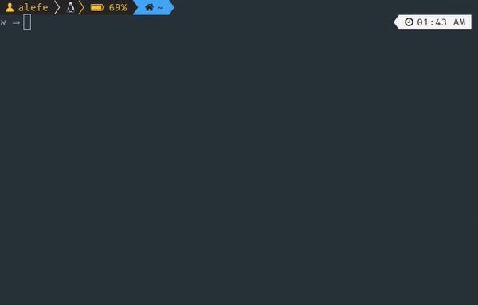

# alefesouza



```bash
$ npm install alefesouza
```

and

```js
console.log(require('alefesouza'));
```

To get my contact information.

## Credits

Thanks to [John K. Paul](https://github.com/johnkpaul/johnkpaul) for the idea.
