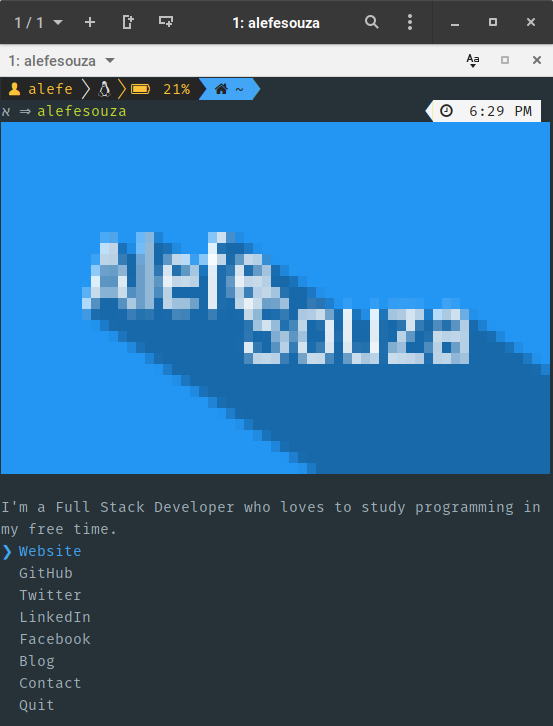

# alefesouza

> The [Alefe Souza](https://alefesouza.com) CLI



## Usage

To install the CLI, first install Node.js, then:

```bash
$ npm install -g alefesouza
```

and run:

```bash
$ alefesouza
```

You can access my information without open CLI, just put what do you want to open after it, like:

```bash
$ alefesouza github
```

Will open my GitHub profile, you can also just show some of my information on terminal, like:

```bash
$ alefesouza show email
$ contact@alefesouza.com

$ alefesouza show website
$ https://alefesouza.com
```

To install on Node projects, run:

```bash
$ npm install alefesouza
```

and

```js
console.log(require('alefesouza'));
```

To get my contact information, you can also use the destructuring assignment, like:

```js
const { email } = require('alefesouza');

console.log(email) // contact@alefesouza.com
```

## Built with

- [ink](https://github.com/vadimdemedes/ink) - React for interactive command-line apps
- [terminal-image](https://github.com/sindresorhus/terminal-image) - Display images in the terminal

## Credits

The CLI is based on [Sindre Sorhus CLI](https://github.com/sindresorhus/sindresorhus), the JSON is based on [John K. Paul](https://github.com/johnkpaul/johnkpaul) idea.
